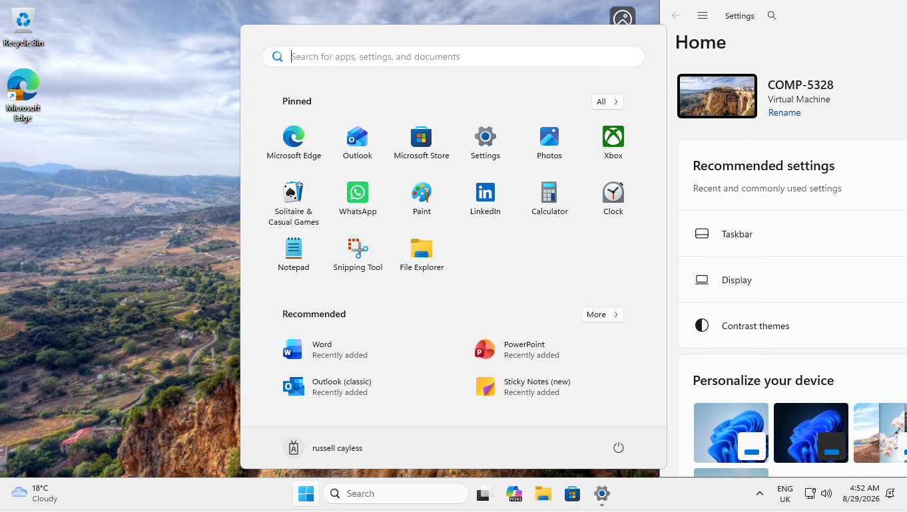

# Windows Autopilot V1 

## Platforms and Languages Leveraged

- EDR Platform: Microsoft Defender for Endpoint

## What you'll do:
Setup Autopilot V1 and enrol Windows VM 

## Prerequisite Environment Checks:

- Ensure Intune license configured
- Check MDM authority is Intune, this link allow you to set authority...
  
      https://intune.microsoft.com/#view/Microsoft_Intune_Enrollment/ChooseMDMAuthorityBlade/


  
- Intune - Devices - Enrollment - Device Platform Restriction - Create restriction


- Name restriction 


- Block personally owned devices


- Scope tags


- Assign to all users


- Create restriction


- New restriction becomes priority


---

## Windows Autopilot V1

1. Capture and save hardware hash 

```
[Net.ServicePointManager]::SecurityProtocol = [Net.SecurityProtocolType]::Tls12
New-Item -Type Directory -Path "C:\HWID"
Set-Location -Path "C:\HWID"
$env:Path += ";C:\Program Files\WindowsPowerShell\Scripts"
Set-ExecutionPolicy -Scope Process -ExecutionPolicy RemoteSigned
Install-Script -Name Get-WindowsAutopilotInfo
Get-WindowsAutopilotInfo -OutputFile AutopilotHWID.csv
```


2. In Intune Devices - Enrollment - Devices - Import the hash.csv file

3. Device will appear

4. Assign user to the device

5. Create deployment profile, Device - Enrollment - Windows Autopilot Deployment profiles - Create Profiles - Windows PC, name the profile

6. Configure OOBE, device name template added in this example

7. Assign to all devices

8. Create profile

9. Create an app, Apps - Windows - Create (MS 365 Apps in example)

10. Configure app information

11. Configure app suite

12. Add to all devices

13. Create app

14. Reset Windows VM

15. User automatically assigned to device, enter password 

16. Device setup with name and MS 365 apps installed



